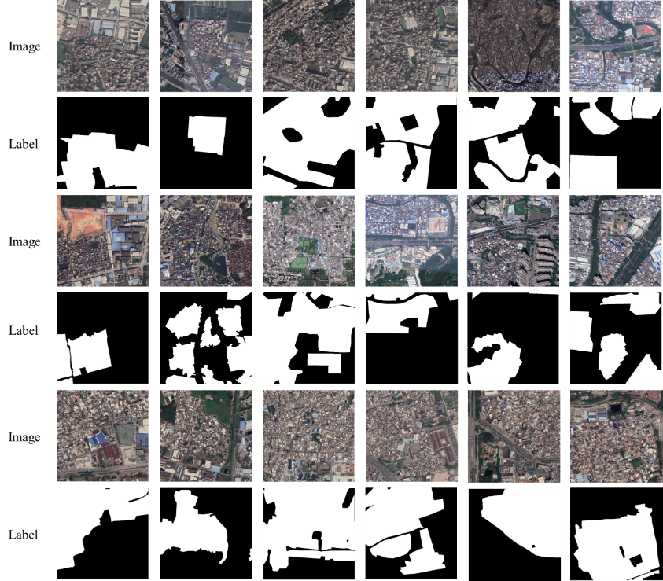

# UVSet
Dataset for "Combining Satellite Imagery and Deep Learning for Large-scale Evaluation and Analysis of Housing Inequality: Case study of Pearl River Delta, China"

A fine-grained urban village dataset is proposed for large-scale urban village extraction from satellite imagery.

   
